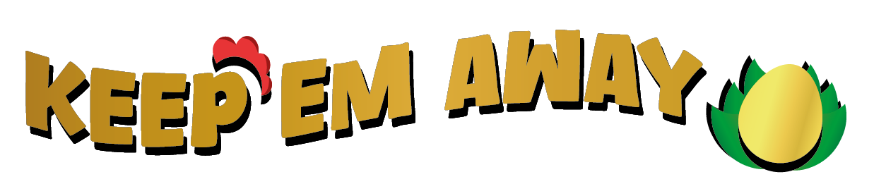

<!-- PROJECT LOGO -->

  

  <h3 align="center">KEEP'EM AWAY | SHOOTER VIDEO GAME</h3>

  

   Keep'em Away es un shooter de estrategia y survival en 3D donde el jugador controla a Eggberto, un campesino que debe mantenerse con vida mientras defiende su huevo de oro de
incontables hordas de enemigos tratando de llevárselo. 
    <a href="https://parapio.itch.io/keepem-away"><strong>Pulsa aquí para jugarlo »</strong></a>
     
  

<!-- Table of Contents -->
# :notebook_with_decorative_cover: TABLA DE CONTENIDOS

- [Capturas y Videos](#capture)
- [Resumen Del Juego](#resume)
  * [Jugabilidad](#jugability)
  * [Mentalidad](#mindset)
  * [Destacados](#feature)
- [Desarrollo del Juego](#dev)
  * [Flujo del juego](#flow)
- [Deseño del Juego](#design)
  * [Diseño de nivel](#level)
  * [Diseño Visual](#visual)
  * [UI-UX](#ui)
  * [Música - SFX](#music)

<!-- Capturas y Videos -->
# :camera: Capturas y Videos 
 

  

<!-- Resumen del Juego -->
# 📖 Resumen
 

  
Eggberto era un campesino común y corriente, pero tras hacerse
con el legendario huevo de oro, se vol v ió el hombre más
codiciado de todo el reino. Y por codiciado, claramente nos
referimos a que todo el mundo quiere arrancarle la cabeza y
l levarse su preciado tesoro. En Keep'em Away , el jugador deberá
enfrentar incontables oleadas de. . . ¿gal l inas?, tratando de
mantenerse con v ida mientras protege a toda costa su huevo de
oro.

    
   - ## 🎮 Jugabilidad
 

  
Keep'em Away es un shooter de estrategia y survival en 3D donde
el jugador controla a Eggberto, un campesino que debe
mantenerse con v ida mientras defiende su huevo de oro de
incontables hordas de enemigos tratando de llevárselo.
Descripción

El objetivo principal es sobrevivir el mayor tiempo posible
mientras se gestionan recursos y power-ups para aumentar las
probabilidades de supervivencia. A medida que avanza, el jugador
deberá adaptarse a enemigos cada vez más fuertes y numerosos.

 - ## 🧔 Mentalidad
 

  
Queremos que el jugador adopte una mental idad de supervivencia
y protección, sintiendo la necesidad de defender su huevo de oro.
A medida que avance en el juego, las oleadas de enemigos se
volverán más fuertes y numerosas, haciendo cada vez más difícil
resistir y evitar que se roben su huevo. Además, buscamos
fomentar un enfoque estratégico en la gestión de recursos y
power-ups, permitiéndole al jugador aumentar sus probabilidades
de éxito.

 - ## 💡 Destacado
 

  
Dificultad progresi va: Las oleadas de enemigos se vuelven más
fuertes y numerosas, haciendo cada vez más difícil sobrevivir.
Instinto de super vivencia: El jugador debe confiar en sus
instintos para lograr permanecer con vida el mayor tiempo
posible mientras protege su huevo de oro.

<!-- Resumen del Juego -->
# ⚡ Desarrollo del Juego
 

  
Keep'Em Away es un shooter frenético desarrollado en Unity 6 utilizando C# con arquitecturas de software avanzadas. Implementa patrones de diseño como:

### 🔧 **Patrones de Diseño**
- [x] **Singleton** Para gestión centralizada de Audio, GameManager y Scenes.
  - `GameManager`: Única instancia para control de estados.
  - `AudioManager`: Única instancia para administrar el Audimixer, Musica y Efectos de Sonido.
- [x] **Observer**  para eventos de gameplay 
  - Eventos C# personalizados para comunicación entre sistemas.
  - Ejemplo: `OnEnemyDeath` → Actualiza contador de muertes en UI y logros.
- [x] **Object Pooling** optimizado para instanciación dinámica de enemigos/proyectiles
  - Pool para proyectiles (`BulletPool.cs`) con pre-warming en Awake().

### 🎮 **Gameplay Systems**
- **Player Controller**
  - Input System de Unity Optimizados para Mobile, Consolas y Escritorio (configuración de eventos).
  - Física personalizada con `CharacterController`.
- **Spawn System**
  - Oleadas de enemigos y Spaws.
  - Lógica de dificultad progresiva.

### ⚙️ **Optimización**
- **Código**
  - Coroutines para tareas asíncronas (ej: spawn enemigos escalonado).
  - Cacheo de componentes con `[SerializeField] private Rigidbody _rb;`.

  ## 💡 Flujo del Juego
 

  
El jugador comienza en un punto predeterminado del mapa con el
huevo de oro a sus espaldas, el cual debe proteger a toda costa.
Controla tanto el mov imiento del personaje como la cámara en
tercera persona, lo que le permite vigilar su entorno y anticipar
el origen de los ataques enemigos. La cámara sigue
constantemente al personaje, brindándole libertad para ajustar su
dirección y rotación.

   
Para defenderse a sí mismo y al huevo de oro, el jugador cuenta
con un arma con la que puede disparar proyecti les a los
enemigos. A medida que la dificultad aumenta, deberá aprovechar
los recursos disponibles, como power-ups, torretas y la propia
disposición del mapa, para resistir las incesantes oleadas de enemigos y sobrevivir el mayor tiempo posible.

# 🖌️ Diseño Juego
 

## 🔥 Diseño de Niveles
 

  
El diseño del mundo está ambientado en el campo, así que tanto
el paisaje como los personajes siguen esta estética. Teniendo en
cuenta que el jugador es un campesino, el mapa utiliza assets de
granja, con sembrados, corrales, si los, entre otros.

## 🗡️ Diseño del Juego
 

   
  ### Paleta de colores
Utilizaremos principalmente una paleta de colores tierra, con
tonal idades de verde, rojo, naranja y marrón, para darle un aire
campesino tanto al paisaje y a los personajes como a la interfaz.

### Atributos/elementos estilísticos
Tendremos un esti lo 3D caricaturesco. Contamos con un diseño de
personajes propio, así como armas y power-ups. También
implementaremos nuestro propio diseño de UI . Para el mapa
uti l izamos un paquete de assets de Unit y Assets Store.

### Efectos visuales
Además de las animaciones de los personajes, buscamos apl icar
efectos de partículas y post-processing para hacer la experiencia
más dinámica y entretenida.

## 💣UI-UX
 

  
Para la interfaz de usuario, se optó por darle un esti lo artístico
con diseños que hagan referencia a elementos propios de
alimentos derivados de animales de granja, así como huevos y
tocino.

## 💣Música y SFX
 

  
Para la música, buscaremos pistas que encajen con el estilo
visual , resaltando el elemento caricaturesco y brindando la
sensación de persecución frenética por parte de los enemigos.

   
En cuanto a los efectos de sonido, procuraremos que cada acción
tenga su correspondiente efecto, siguiendo la misma estética. De
igual manera, queremos que toda la experiencia sea interacti va,
por lo que esperamos que también la UI tenga efectos propios.

